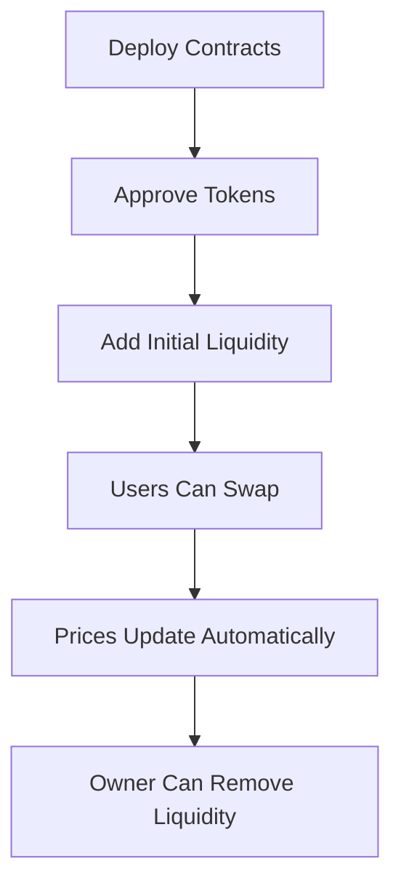

# 🚀 SimpleDEX - Exchange Descentralizado

Un exchange descentralizado (DEX) simple implementado en Solidity que permite el intercambio de dos tokens ERC-20 usando pools de liquidez y la fórmula del producto constante.

## 📋 Descripción del Proyecto

SimpleDEX es un exchange descentralizado básico que implementa las funcionalidades core de un AMM (Automated Market Maker):

- **Pools de Liquidez**: Mantiene reservas de dos tokens (TokenA y TokenB)
- **Intercambio Automático**: Usa la fórmula del producto constante para calcular precios
- **Gestión de Liquidez**: Permite añadir y retirar liquidez del pool
- **Intercambios Bidireccionales**: Swap de TokenA ↔ TokenB

## 🏗️ Arquitectura del Sistema

### Contratos Principales

1. **TokenA**: Token ERC-20 estándar (TKNA)
2. **TokenB**: Token ERC-20 estándar (TKNB)  
3. **SimpleDEX**: Contrato principal del exchange

### Fórmula del Producto Constante

El DEX utiliza la fórmula AMM estándar:
```
(x + Δx) × (y - Δy) = x × y
```

Donde:
- `x`, `y` = Reservas actuales de TokenA y TokenB
- `Δx` = Cantidad de tokens de entrada
- `Δy` = Cantidad de tokens de salida

## 🛠️ Funcionalidades

### Para el Owner (Propietario)
- ✅ `addLiquidity()` - Añadir liquidez al pool
- ✅ `removeLiquidity()` - Retirar liquidez del pool
- ✅ `emergencyWithdraw()` - Retirada de emergencia de tokens

### Para Usuarios
- ✅ `swapAforB()` - Intercambiar TokenA por TokenB
- ✅ `swapBforA()` - Intercambiar TokenB por TokenA

### Funciones de Consulta
- ✅ `getPrice()` - Obtener precio de un token
- ✅ `getReserves()` - Consultar reservas del pool
- ✅ `getAmountOut()` - Calcular output de intercambio
- ✅ `getTokenAddresses()` - Obtener direcciones de tokens

## 📊 Cómo Funciona

### 1. Inicialización
```solidity
// El owner despliega los contratos
TokenA tokenA = new TokenA();
TokenB tokenB = new TokenB();
SimpleDEX dex = new SimpleDEX(address(tokenA), address(tokenB));
```

### 2. Añadir Liquidez
```solidity
// El owner aprueba tokens
tokenA.approve(address(dex), 1000 * 10**18);
tokenB.approve(address(dex), 2000 * 10**18);

// Añade liquidez inicial (ratio 1:2)
dex.addLiquidity(1000 * 10**18, 2000 * 10**18);
```

### 3. Realizar Intercambios
```solidity
// Usuario aprueba tokens
tokenA.approve(address(dex), 100 * 10**18);

// Intercambia 100 TokenA por TokenB
dex.swapAforB(100 * 10**18);
```

### 4. Cálculo de Precios
El precio se calcula dinámicamente basado en las reservas:
```solidity
// Precio de TokenA = reserveB / reserveA
uint256 priceA = dex.getPrice(address(tokenA));
```

## 🔧 Instalación y Despliegue

### Prerrequisitos
- Node.js v16+
- Hardhat o Remix IDE
- Metamask configurado en Scroll Sepolia

### Pasos de Despliegue

1. **Compilar Contratos**
```bash
npx hardhat compile
```

2. **Desplegar en Scroll Sepolia**
```bash
npx hardhat run scripts/deploy.js --network scrollSepolia
```

3. **Verificar Contratos**
```bash
npx hardhat verify --network scrollSepolia CONTRACT_ADDRESS
```

### Configuración de Red (hardhat.config.js)
```javascript
networks: {
  scrollSepolia: {
    url: "https://sepolia-rpc.scroll.io/",
    chainId: 534351,
    accounts: [PRIVATE_KEY]
  }
}
```

## 📝 Uso del Contrato

### Ejemplo Completo de Uso

```javascript
// 1. Conectar a los contratos
const tokenA = await ethers.getContractAt("TokenA", TOKEN_A_ADDRESS);
const tokenB = await ethers.getContractAt("TokenB", TOKEN_B_ADDRESS);
const dex = await ethers.getContractAt("SimpleDEX", DEX_ADDRESS);

// 2. Aprobar tokens
await tokenA.approve(DEX_ADDRESS, ethers.utils.parseEther("1000"));
await tokenB.approve(DEX_ADDRESS, ethers.utils.parseEther("2000"));

// 3. Añadir liquidez inicial
await dex.addLiquidity(
  ethers.utils.parseEther("1000"), // 1000 TokenA
  ethers.utils.parseEther("2000")  // 2000 TokenB
);

// 4. Realizar intercambio
await dex.swapAforB(ethers.utils.parseEther("100")); // 100 TokenA

// 5. Consultar precio
const price = await dex.getPrice(TOKEN_A_ADDRESS);
console.log(`1 TokenA = ${ethers.utils.formatEther(price)} TokenB`);
```

## 📋 API Reference

### SimpleDEX Contract

#### Constructor
```solidity
constructor(address _tokenA, address _tokenB)
```

#### Funciones Principales
```solidity
function addLiquidity(uint256 amountA, uint256 amountB) external onlyOwner
function removeLiquidity(uint256 amountA, uint256 amountB) external onlyOwner
function swapAforB(uint256 amountAIn) external
function swapBforA(uint256 amountBIn) external
function getPrice(address _token) external view returns (uint256)
function getReserves() external view returns (uint256, uint256)
function getAmountOut(uint256 amountIn, address tokenIn) external view returns (uint256)
```

#### Eventos
```solidity
event LiquidityAdded(address indexed provider, uint256 amountA, uint256 amountB)
event LiquidityRemoved(address indexed provider, uint256 amountA, uint256 amountB)
event SwapExecuted(address indexed user, address indexed tokenIn, address indexed tokenOut, uint256 amountIn, uint256 amountOut)
event PriceUpdated(uint256 reserveA, uint256 reserveB)
```

## 🧪 Testing

### Ejecutar Tests
```bash
npx hardhat test
```

### Casos de Prueba Incluidos
- ✅ Despliegue correcto de contratos
- ✅ Añadir y retirar liquidez
- ✅ Intercambios bidireccionales
- ✅ Cálculo de precios
- ✅ Manejo de errores
- ✅ Permisos y restricciones

## 📊 Ejemplo de Flujo Completo



## ⚠️ Consideraciones de Seguridad

- **Solo Owner**: Añadir/retirar liquidez limitado al propietario
- **Validaciones**: Verificación de cantidades y direcciones
- **Slippage**: Los precios cambian con cada intercambio
- **Liquidez Mínima**: Prevención de división por cero

## 🔍 Direcciones de Contratos (Scroll Sepolia)

```
TokenA: 0x... (Actualizar después del despliegue)
TokenB: 0x... (Actualizar después del despliegue)
SimpleDEX: 0x... (Actualizar después del despliegue)
```

## 📚 Recursos Adicionales

- [Documentación de Solidity](https://docs.soliditylang.org/)
- [OpenZeppelin Contracts](https://docs.openzeppelin.com/contracts/)
- [Scroll Sepolia Testnet](https://sepolia.scrollscan.com/)
- [Hardhat Documentation](https://hardhat.org/docs)

## 🤝 Contribución

1. Fork el repositorio
2. Crea una rama para tu feature (`git checkout -b feature/nueva-funcionalidad`)
3. Commit tus cambios (`git commit -m 'Añadir nueva funcionalidad'`)
4. Push a la rama (`git push origin feature/nueva-funcionalidad`)
5. Abre un Pull Request

## 📄 Licencia

Este proyecto está bajo la Licencia MIT - ver el archivo [LICENSE](LICENSE) para más detalles.

## 👨‍💻 Autor

- **Tu Nombre** - [Katherin Dominguez](https://github.com/KatherinDominguez)

## 🙏 Agradecimientos

- OpenZeppelin por los contratos seguros
- Scroll por la red de pruebas
- Comunidad Ethereum por la documentación

---

⭐ Si este proyecto te fue útil, ¡dale una estrella!

## 📞 Contacto

- Email: kizel.mamani@gmail.com
